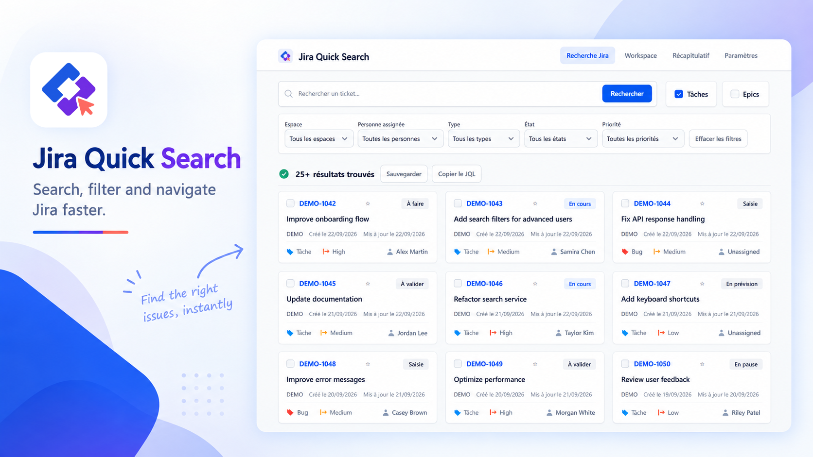
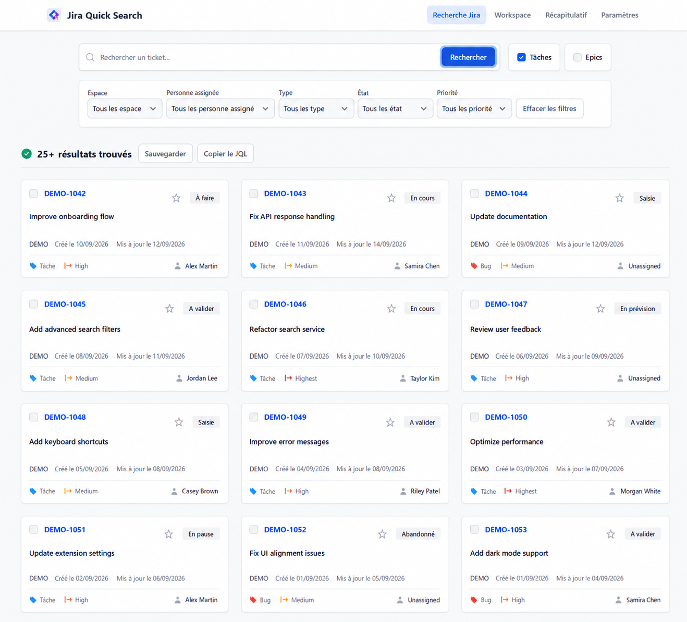
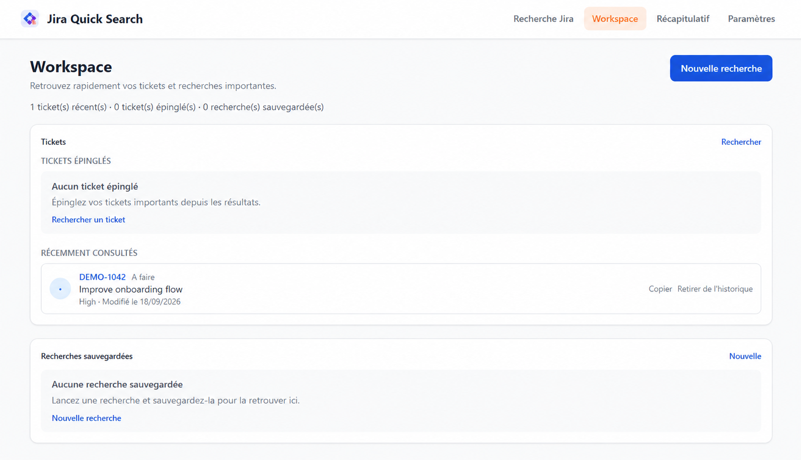
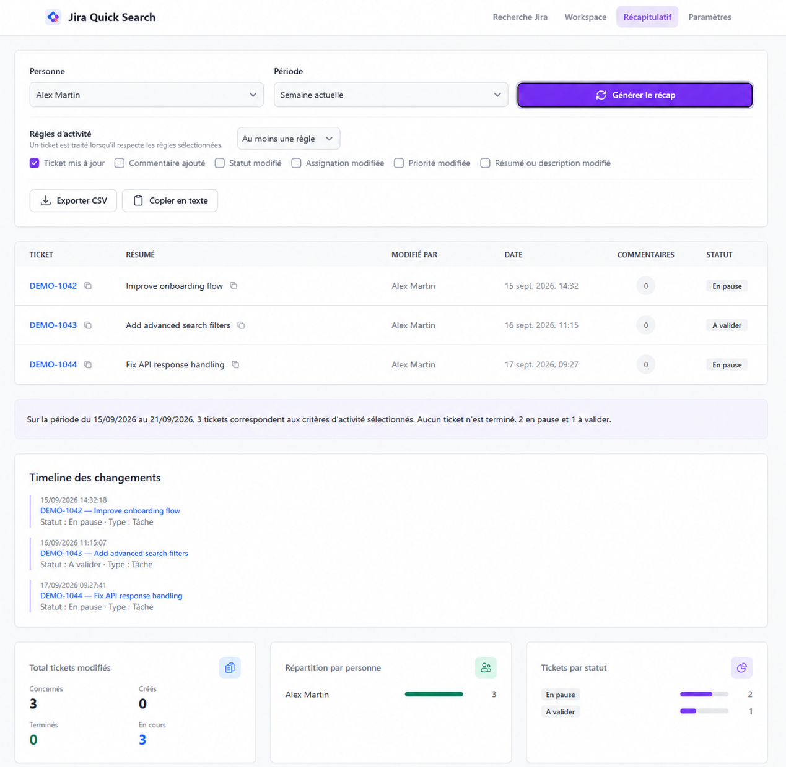

<p align="center">
  
</p>

<p align="center">
  Rechercher, filtrer et exploiter ses tickets Jira plus rapidement depuis Chrome.
</p>

<p align="center">
  
  
  
</p>

# Jira Quick Search

Jira Quick Search est une extension Chrome dédiée à Jira Cloud. Elle centralise
la recherche de tickets, les filtres utiles et quelques outils de suivi dans une
interface locale, accessible directement depuis le navigateur.

L’objectif est simple : retrouver un ticket, ouvrir les bons résultats et
consulter son activité sans multiplier les manipulations dans Jira.

## Fonctionnalités

- Recherche plein texte dans les tickets, résumés et descriptions.
- Filtres par projet, personne assignée, type, état et priorité, avec prise en
  charge des champs personnalisés disponibles dans Jira.
- Affichage des informations principales d’un ticket et ouverture dans Jira ou
  dans plusieurs onglets.
- Workspace personnel avec tickets récents, tickets épinglés et recherches
  sauvegardées.
- Récapitulatif d’activité configurable par période, personne et règles de
  traitement.
- Statistiques par personne et par statut, export CSV et copie au format
  Markdown.
- Pagination des résultats avec les curseurs Jira et copie du JQL généré.
- Raccourci `Ctrl+Shift+J` et recherche via l’omnibox Chrome avec le mot-clé
  `jira`.
- Diagnostics de connexion, logs locaux optionnels et génération d’un brouillon
  GitHub pour un bug ou une proposition de fonctionnalité.

## Aperçu

### Recherche Jira

<p align="center">
  
</p>

### Workspace

<p align="center">
  
</p>

### Récapitulatif d’activité

<p align="center">
  
</p>

## Installation

Jira Quick Search est actuellement distribuée comme extension non empaquetée
pour Chrome.

1. Clonez ou téléchargez ce dépôt.
2. Ouvrez `chrome://extensions/` dans Chrome.
3. Activez le **Mode développeur**.
4. Cliquez sur **Charger l’extension non empaquetée**.
5. Sélectionnez le dossier racine du dépôt, celui qui contient `manifest.json`.
6. Ouvrez l’extension et suivez l’onboarding pour configurer Jira.

## Configuration et utilisation

### Configurer Jira

Lors de la première ouverture, l’onboarding vous guide pour renseigner :

- l’URL racine de votre instance Jira Cloud, sans slash final ;
- votre adresse email Atlassian ;
- un token API Atlassian.

Le bouton de test vérifie la connexion et l’accès aux données nécessaires.
L’URL de création d’un token est disponible depuis la page de sécurité Atlassian :
<https://id.atlassian.com/manage-profile/security/api-tokens>.

### Rechercher un ticket

Ouvrez la recherche depuis l’icône de l’extension, avec `Ctrl+Shift+J`, ou en
utilisant l’omnibox Chrome : tapez `jira`, puis votre recherche. Saisissez un
texte, choisissez les filtres souhaités et lancez la recherche. Les résultats
peuvent être ouverts individuellement ou en sélection multiple.

### Utiliser le Workspace

Le **Workspace** regroupe les tickets récemment consultés, les tickets épinglés
et les recherches sauvegardées. Il permet aussi de copier rapidement un lien ou
de retirer un élément de l’espace personnel.

### Générer un récapitulatif

La page **Récapitulatif** permet de choisir une période, une personne assignée
et des règles d’activité. Le résultat peut être exporté en CSV ou copié sous
forme de rapport Markdown.

## Architecture

Les points d’entrée HTML de l’extension sont à la racine du dépôt. Le code
applicatif partagé est organisé dans `src/` :

```text
.
├── onboarding.html, search.html, workspace.html, recap.html, options.html, popup.html
├── background.js                 # Service worker Manifest V3 et routage
├── src/
│   ├── pages/                    # Scripts de l’onboarding et des pages métier
│   ├── components/               # Navbar et composants d’interface partagés
│   ├── services/                 # API Jira, diagnostics et journalisation
│   ├── utils/                    # Filtres, workspace, rapports et feedback
│   └── assets/icons/             # Logos et icônes de l’extension
├── tests/                        # Tests unitaires et structurels
├── scripts/                      # Validation et tests de syntaxe
└── vendor/                       # Ressources CSS locales
```

Le projet ne nécessite pas de bundler ni de dépendances installées dans
`node_modules`. Les commandes de validation sont disponibles dans `scripts/`.

Pour générer le package minimal destiné à Chrome :

```powershell
.\scripts\package-extension.ps1
```

Le ZIP versionné est créé dans `dist/`, avec `manifest.json` directement à sa
racine. Le script exclut les fichiers de développement, la documentation, les
captures, les médias et les données sensibles.

## Confidentialité et sécurité

Consultez la [politique de confidentialité](PRIVACY.md) pour le détail des
données utilisées, de leur stockage, des transmissions et des permissions
Chrome.

- L’extension communique directement avec l’instance Jira configurée via son API
  REST v3. Aucun serveur intermédiaire, outil d’analytics ou autre service tiers
  n’est utilisé.
- L’URL Jira, l’adresse e-mail et le token API sont enregistrés dans
  `chrome.storage.sync` afin de permettre leur réutilisation. L’extension ne
  chiffre pas elle-même ces valeurs.
- Les préférences de diagnostic, tickets récents, tickets épinglés et recherches
  sauvegardées sont conservés dans `chrome.storage.local`. Les règles d’activité
  du récapitulatif sont synchronisées avec la configuration.
- Le token est masqué dans l’interface et exclu des logs, diagnostics, brouillons
  GitHub et messages d’erreur.
- Le feedback intégré prépare un brouillon GitHub modifiable. L’extension ne
  crée pas automatiquement d’issue et ne conserve pas le brouillon.
- Les permissions Chrome sont limitées à `storage`, nécessaire à la
  configuration et aux préférences, ainsi qu’à l’accès aux domaines
  `https://*.atlassian.net/*`, nécessaire aux appels Jira.

Ne partagez jamais votre token API. En cas d’exposition, révoquez-le depuis
Atlassian. Pour signaler une vulnérabilité, consultez [SECURITY.md](SECURITY.md).

## Limites connues

- L’extension cible Jira Cloud et l’API REST Jira v3 ; elle n’est pas présentée
  comme compatible avec les installations Jira Server ou Data Center.
- Les projets, utilisateurs, champs et historiques visibles dépendent des droits
  du compte Jira configuré.
- Les champs personnalisés peuvent ne pas fournir leurs options lorsque Jira
  restreint leur contexte ou leur accès.
- La génération d’un récapitulatif peut prendre plus de temps pour un volume
  important de tickets, car l’extension consulte également les historiques
  accessibles.
- L’extension est actuellement installée manuellement depuis le dépôt et n’est
  pas publiée sur le Chrome Web Store.

## Développement

Le projet peut être vérifié depuis PowerShell avec :

```powershell
.\scripts\validate-extension.ps1
.\scripts\test-extension.ps1
```

Les tests individuels se trouvent dans `tests/` et peuvent être exécutés avec
Node.js, par exemple :

```powershell
node tests\workspace.test.js
```

## Contribution

Les contributions sont les bienvenues. Consultez [CONTRIBUTING.md](CONTRIBUTING.md)
avant de proposer une modification.

## Licence

Jira Quick Search est distribué sous licence MIT. Voir [LICENSE](LICENSE).
